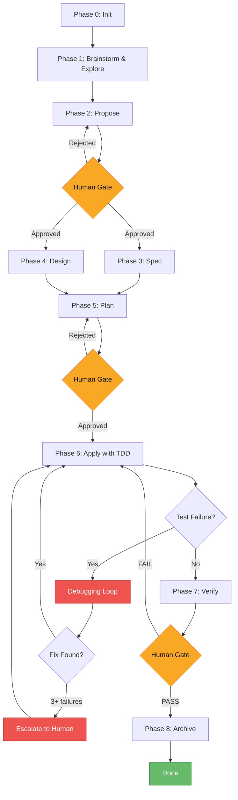
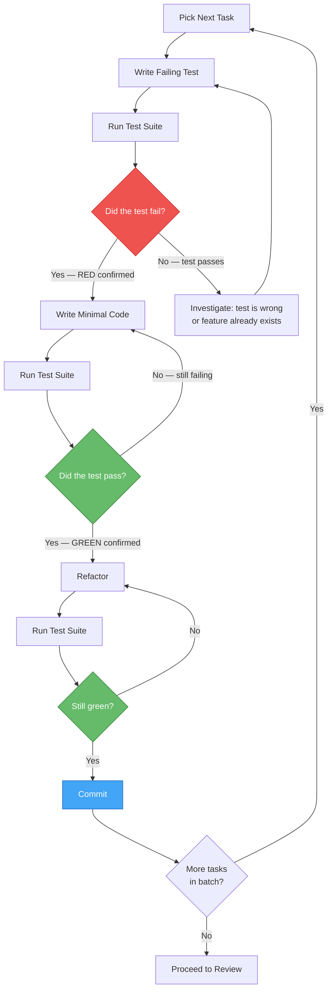
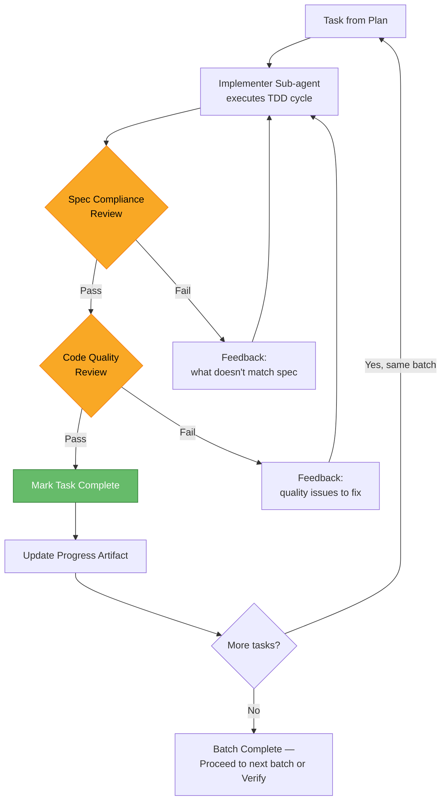

# AI-Flow: Unified AI-Assisted Development Workflow

## Introduction

AI-Flow is a unified development workflow that combines the **planning rigor** of Spec-Driven Development (SDD) with the **execution discipline** of Test-Driven Development (TDD). It provides a structured, phase-based approach to building software with AI sub-agents — where every feature moves through a clear pipeline from exploration to archived completion, and every line of production code is backed by a failing test that demanded its existence.

This document is intended for **development teams adopting AI-assisted development**. Whether you are pairing with a single AI agent or orchestrating a fleet of specialized sub-agents, AI-Flow gives you a repeatable process that balances speed with correctness.

---

## Core Principles

These eight principles govern every phase of AI-Flow. They are non-negotiable.

| # | Principle | Origin | Rationale |
|---|-----------|--------|-----------|
| 1 | **Orchestrator never does real work** | Agent Teams | The coordinator delegates all implementation, analysis, and investigation to sub-agents with fresh context. This prevents context bloat, preserves the orchestrator's ability to manage state across a long session, and keeps each task focused. |
| 2 | **No production code without a failing test first** | Superpowers | Every line of production code exists because a test demanded it. This is the iron law of TDD. It ensures that code is always testable, always justified, and never speculative. |
| 3 | **Evidence over claims — verify before declaring success** | Superpowers | No sub-agent may claim a task is complete without providing fresh verification evidence (test output, build logs, type-check results). "It should work" is not evidence. |
| 4 | **Structured artifacts at every phase** | Agent Teams | Each phase produces a named, versioned artifact (exploration report, proposal, spec, design, plan, verification report). These artifacts form the project's decision trail and enable recovery after context loss. |
| 5 | **Human review gates between phases** | Agent Teams | The developer approves proposals, specs, plans, and verification reports before the workflow advances. AI suggests; humans decide. |
| 6 | **Tracer bullets — tiny end-to-end slices first** | Agent Teams | Before building the full feature, implement the thinnest possible slice that touches every layer of the system. Get feedback on that slice before expanding. This validates architecture early and cheaply. |
| 7 | **Fresh context per task** | Both | Sub-agents receive only the context they need for their specific task. This prevents cross-contamination, reduces hallucination risk, and allows parallel execution. |
| 8 | **Systematic over ad-hoc — process over guessing** | Superpowers | When something breaks, follow a systematic debugging protocol (investigate root cause, form hypotheses, test them) rather than guessing and patching. |

---

## The Unified Phase Flow

### Phase 0: Init

**Purpose:** Bootstrap the project environment so all subsequent phases have what they need.

**Activities:**
- Detect the technology stack (language, framework, test runner, package manager)
- Bootstrap artifact persistence (engram, filesystem, or hybrid)
- Build the skill registry — discover available sub-agent skills
- Identify existing specs, test suites, and CI configuration
- Establish naming conventions for branches, commits, and artifacts

**Output:** Project context artifact containing stack info, persistence config, and skill inventory.

**Who does it:** Orchestrator dispatches an init sub-agent.

---

### Phase 1: Brainstorm & Explore

**Purpose:** Understand the problem space and the existing codebase before committing to an approach.

This phase merges the creative exploration from Superpowers' brainstorming with the codebase investigation from SDD's explore phase.

**Activities:**
- **Problem exploration:** What are we trying to solve? What are the constraints? What does success look like?
- **Codebase investigation:** What exists today? What patterns does the codebase use? Where would changes land?
- **Approach generation:** Produce 2-3 candidate approaches, each with:
  - Description of the approach
  - Trade-offs (pros / cons)
  - Complexity estimate
  - Risk assessment
- **Domain knowledge capture:** Record any domain insights surfaced during exploration

**Output:** Exploration artifact — analysis of the problem space, codebase findings, and candidate approaches with trade-offs.

**Who does it:** Explorer sub-agent.

---

### Phase 2: Propose

**Purpose:** Commit to a single approach and define the change formally.

**Activities:**
- Select the best approach from Phase 1 (or synthesize a hybrid)
- Write a change proposal containing:
  - **Intent:** What this change accomplishes and why
  - **Scope — In:** What is included in this change
  - **Scope — Out:** What is explicitly excluded
  - **Approach:** How the change will be implemented (high level)
  - **Risks:** What could go wrong and how to mitigate it
  - **Rollback plan:** How to undo this change if needed
  - **Success criteria:** Measurable conditions that define "done"

**Output:** Proposal artifact.

**Gate:** Human reviews and approves the proposal before proceeding.

**Who does it:** Proposer sub-agent.

---

### Phase 3: Spec (parallel with Phase 4)

**Purpose:** Define *what* the system must do after the change — in testable terms.

**Activities:**
- Write delta specifications organized as ADDED / MODIFIED / REMOVED requirements
- For every requirement, write **Given/When/Then scenarios** — these become the test cases for TDD in Phase 6
- Every requirement must have at least one testable scenario; complex requirements should have multiple (happy path, edge cases, error cases)
- Cross-reference scenarios with success criteria from the proposal

**Output:** Spec artifact — delta requirements with testable scenarios.

**Critical rule:** If a requirement cannot be expressed as a Given/When/Then scenario, it is too vague. Refine it until it is testable.

**Who does it:** Spec sub-agent. Reads the proposal artifact as input.

---

### Phase 4: Design (parallel with Phase 3)

**Purpose:** Define *how* the system will implement the spec — the technical blueprint.

**Activities:**
- Define the technical approach and architecture decisions (with rationale for each decision)
- List file changes: new files, modified files, deleted files
- Define interfaces, data structures, and data flow
- Document integration points and dependencies
- Write a **testing strategy** that maps directly to the spec scenarios:
  - Which scenarios become unit tests?
  - Which become integration tests?
  - Which need end-to-end tests?
  - What mocking/stubbing strategy is needed?

**Output:** Design artifact — technical blueprint with architecture decisions and testing strategy.

**Who does it:** Design sub-agent. Reads the proposal artifact as input.

---

### Phase 5: Plan

**Purpose:** Break the work into bite-sized, ordered tasks — each with TDD steps baked in.

This phase replaces SDD's generic task breakdown with Superpowers' detailed writing-plans approach, ensuring every task is small enough to execute reliably and every task carries its own test plan.

**Activities:**
- Break the design into tasks of **2-5 minutes each** (for an AI sub-agent)
- Each task definition includes:
  - **Description:** What this task accomplishes
  - **File paths:** Exact files to create or modify
  - **TDD steps:**
    1. Write the failing test (referencing which spec scenario)
    2. Verify it fails
    3. Write minimal implementation
    4. Verify it passes
    5. Refactor if needed
  - **Dependencies:** Which tasks must complete before this one
  - **Acceptance criteria:** How to know this task is done
- Order tasks by dependency, group into execution batches
- Identify the **tracer bullet task** — the smallest task that touches all layers end-to-end
- Run a **plan review loop** with a reviewer sub-agent to catch gaps, ordering issues, or missing test coverage

**Output:** Plan artifact — ordered task list with TDD steps, grouped into batches.

**Gate:** Human reviews and approves the plan before execution begins.

**Who does it:** Planner sub-agent (writes), Reviewer sub-agent (reviews).

---

### Phase 6: Apply with TDD

**Purpose:** Execute the plan — writing code through strict TDD, with two-stage reviews.

This is the core execution phase, merging SDD's apply phase with Superpowers' TDD discipline and subagent-driven development model.

#### Tracer Bullet First

Before executing the full plan, implement the tracer bullet task identified in Phase 5. This is the thinnest end-to-end slice of the feature. Get it working, get feedback, and validate the architecture before expanding.

#### For Each Task in the Plan

An implementer sub-agent executes the TDD cycle:

| Step | Action | Verification |
|------|--------|-------------|
| 1. RED | Write the failing test (derived from spec scenario) | — |
| 2. Verify RED | Run the test suite | Test MUST fail. If it passes, the test is wrong or the feature already exists. Investigate. |
| 3. GREEN | Write the minimal code to make the test pass | — |
| 4. Verify GREEN | Run the test suite | Test MUST pass. If it fails, fix the implementation (not the test). |
| 5. REFACTOR | Clean up code while keeping tests green | Run tests again to confirm. |
| 6. COMMIT | Commit the passing test + implementation | — |

**Iron law:** Steps 2 and 4 are MANDATORY. Skipping verification is a protocol violation.

#### Two-Stage Review Per Task

After the implementer sub-agent completes a task:

1. **Spec Compliance Review:** Did you build what was asked? Does the implementation satisfy the spec scenario this task was derived from?
2. **Code Quality Review:** Is it well-built? Code style, naming, performance, error handling, no unnecessary complexity.

If either review fails, the task goes back to the implementer with specific feedback.

#### Batch Execution

Tasks are executed in batches (as defined in the plan). Within a batch, independent tasks can run in parallel. Progress is tracked in an apply-progress artifact.

**Output:** Working code with passing tests, committed incrementally. Apply-progress artifact tracking completion status.

**Who does it:** Implementer sub-agents (one per task or batch), Reviewer sub-agents (spec compliance + code quality).

---

### Phase 7: Verify

**Purpose:** Confirm that everything works, everything is covered, and the change meets its success criteria.

**Activities:**
- **Completeness check:** Are all tasks from the plan marked complete?
- **Spec compliance matrix:** Map every Given/When/Then scenario from Phase 3 to a passing test. Every scenario must be covered.
- **Build validation:** Clean build with no errors
- **Type check:** No type errors (for typed languages)
- **Full test execution:** All tests pass (not just new ones — the entire suite)
- **Coverage validation:** Test coverage meets project standards
- **Success criteria check:** Revisit the success criteria from the proposal — are they all met?

**Verdict:**

| Verdict | Meaning |
|---------|---------|
| PASS | All checks green. Ready to merge. |
| PASS WITH WARNINGS | Minor issues noted (e.g., coverage slightly below threshold) but no blockers. |
| FAIL | One or more checks failed. Requires rework. |

**Output:** Verification report artifact with the compliance matrix, test results, and verdict.

**Gate:** Human reviews the verification report before proceeding.

**Who does it:** Verifier sub-agent.

---

### Phase 8: Archive

**Purpose:** Close out the change and preserve the decision trail for future reference.

**Activities:**
- Merge delta specs from Phase 3 into the project's main specification documents
- Archive the change folder (proposal, spec, design, plan, verification report)
- Update any project-level documentation affected by the change
- Clean up temporary branches or worktrees
- Write a brief change summary for the project log

**Output:** Archive report. All artifacts preserved for audit trail.

**Who does it:** Archiver sub-agent.

---

### Debugging Loop (Available at Any Point)

When a test fails unexpectedly during Phase 6 (Apply) — or at any other point — enter the systematic debugging protocol rather than guessing at fixes.

**Step 1: Root Cause Investigation**
- Read the error message and stack trace carefully
- Identify the exact point of failure
- Gather context: what changed recently? What are the inputs?

**Step 2: Pattern Analysis**
- Is this a known pattern (null reference, off-by-one, async race condition)?
- Have we seen similar failures in this codebase before?
- What does the error tell us about the system's state?

**Step 3: Hypothesis Testing**
- Form 1-3 hypotheses about the root cause
- For each hypothesis, identify a way to confirm or refute it
- Test hypotheses systematically (do not shotgun-debug)

**Step 4: Fix with TDD**
- Once the root cause is confirmed, write a test that reproduces the bug
- Verify the test fails (RED)
- Write the fix
- Verify the test passes (GREEN)
- Run the full suite to confirm no regressions

**Escalation rule:** If 3 or more fix attempts fail, STOP. The problem is likely architectural, not local. Escalate to the human developer with a summary of what was tried and why it failed.

---

## Diagrams

### Diagram 1: High-Level Flow



### Diagram 2: TDD Cycle Detail (Within Phase 6)



### Diagram 3: Task Execution with Two-Stage Review



---

## Quick Reference Commands

| Command | Phase | Description |
|---------|-------|-------------|
| `/flow-init` | Phase 0 | Detect stack, bootstrap persistence, build skill registry |
| `/flow-explore <topic>` | Phase 1 | Brainstorm and explore the problem space and codebase |
| `/flow-new <change>` | Phase 1+2 | Explore then propose a new change (shortcut) |
| `/flow-spec` | Phase 3 | Write delta specifications with testable scenarios |
| `/flow-design` | Phase 4 | Write technical design and architecture decisions |
| `/flow-plan` | Phase 5 | Break into bite-sized tasks with TDD steps |
| `/flow-apply` | Phase 6 | Execute the plan with strict TDD and two-stage reviews |
| `/flow-verify` | Phase 7 | Run completeness, compliance, and test verification |
| `/flow-archive` | Phase 8 | Merge specs, archive artifacts, close out the change |
| `/flow-ff` | Phase 2-5 | Fast-forward: propose, spec, design, and plan in sequence |
| `/flow-debug` | Any | Enter systematic debugging mode |

---

## When to Use What

Not every change needs the full ceremony. Match the workflow depth to the change size.

```
Is it a bug fix?
├── Yes
│   └── Use /flow-debug + TDD
│       (Skip planning phases entirely. Investigate, write a
│        reproducing test, fix it, verify.)
│
└── No — it's a feature or refactor
    │
    ├── Small (1-2 files, well-understood change)
    │   └── Lightweight flow:
    │       /flow-explore → /flow-plan → /flow-apply
    │       (Skip proposal, spec, and design. Explore enough to
    │        understand the change, plan the tasks, execute with TDD.)
    │
    ├── Medium (3-10 files, moderate complexity)
    │   └── Full flow:
    │       /flow-new → /flow-spec → /flow-design → /flow-plan → /flow-apply → /flow-verify
    │       (Every phase. Human gates at proposal, plan, and verify.)
    │
    └── Large (10+ files, cross-cutting, high risk)
        └── Full flow + tracer bullet strategy:
            Same as Medium, but during /flow-apply, implement the
            tracer bullet first. Get feedback on the thin slice before
            expanding to the full implementation.
```

| Change Type | Phases Used | Estimated Overhead | When to Choose |
|-------------|-------------|-------------------|----------------|
| Bug fix | Debug + TDD | Minimal | Known bug, clear reproduction steps |
| Small change | Explore → Plan → Apply | Low | 1-2 files, well-understood domain |
| Medium feature | Full flow | Moderate | Multi-file, needs spec and design review |
| Large feature | Full flow + tracer bullet | Higher upfront, lower overall risk | Cross-cutting, architectural impact, high uncertainty |

---

## Role of the Developer

AI-Flow does not replace the developer — it amplifies them. The AI handles the mechanical work (writing boilerplate, running tests, tracking artifacts); the developer provides judgment, domain knowledge, and final authority.

### At Each Gate

| Phase | Developer's Role |
|-------|-----------------|
| **Brainstorm & Explore** | Contribute domain knowledge. Correct misconceptions about the problem space. Suggest approaches the AI may not have considered. |
| **Propose** (Gate) | Review the proposal for scope creep, missing risks, and alignment with product goals. Approve, reject, or request changes. |
| **Spec** | Validate that Given/When/Then scenarios capture the real requirements — especially edge cases and error conditions that come from domain expertise. |
| **Design** | Review architecture decisions. Challenge choices that conflict with team conventions or long-term maintainability. Approve, reject, or request changes. |
| **Plan** (Gate) | Review task breakdown for completeness and ordering. Catch missing tasks, unrealistic scoping, or dependency errors. Approve the plan. |
| **Apply** | Monitor progress. Answer questions when the AI encounters ambiguity. Intervene if the debugging loop escalates. |
| **Verify** (Gate) | Review the verification report. Decide whether warnings are acceptable. Approve for merge or send back for rework. |
| **Archive** | Confirm the change is properly closed out. Spot-check the archived artifacts. |

### When You Get Pulled In

- **Escalation from debugging loop:** 3+ fix attempts failed. The AI will present what it tried and why it thinks the problem is architectural. You decide the path forward.
- **Ambiguity in requirements:** The spec has a gap. The AI will ask a specific question rather than guessing.
- **Architecture decisions:** Trade-offs that affect the broader system (e.g., introducing a new dependency, changing a public API) are escalated for human judgment.

### What You Should NOT Need to Do

- Write boilerplate code
- Manually run tests to check if things pass
- Track which tasks are done and which remain
- Remember what was decided three phases ago (artifacts handle that)
- Context-switch between unrelated implementation details (sub-agents handle isolation)

---

## Summary

AI-Flow is built on a simple insight: **planning and execution require different disciplines, and AI is good at both — but only when given structure.**

The SDD phases provide the planning discipline: explore before you propose, specify before you design, plan before you build, verify before you ship. The TDD cycle provides the execution discipline: every line of code is justified by a failing test, every claim is backed by evidence.

By combining these two workflows and adding orchestrator-based delegation, human review gates, and systematic debugging, AI-Flow gives development teams a repeatable, auditable, and reliable process for AI-assisted development — from the first brainstorm to the final archive.

---

## Credits

This unified workflow synthesizes ideas and practices from two open-source projects:

- **Superpowers** by [obra](https://github.com/obra/superpowers) — TDD discipline, systematic debugging, verification-before-completion, brainstorming protocols, writing plans, subagent-driven development with two-stage reviews.
- **Agent Teams Lite** by [Gentleman Programming](https://github.com/Gentleman-Programming/agent-teams-lite) — Orchestrator pattern, SDD phase pipeline, DAG dependency graph, artifact persistence, tracer bullets, skill registry, human review gates.
